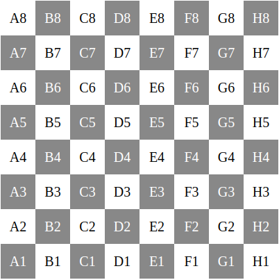

# Chess Board using JS

## Demo



## Code

```html
<!DOCTYPE html>
<html>
  <head>
    <title>Chess Board</title>
    <style>
      .board {
        display: grid;
        grid-template-columns: repeat(8, 50px);
        grid-template-rows: repeat(8, 50px);
      }

      .square {
        width: 50px;
        height: 50px;
        text-align: center;
        line-height: 50px;
        font-size: 20px;
      }

      .black {
        background-color: #888;
        color: #fff;
      }
    </style>
  </head>
  <body>
    <div class="board" id="chessboard"></div>

    <script>
      // Function to generate the chessboard
      function generateChessBoard() {
        const board = document.getElementById("chessboard");

        for (let row = 0; row < 8; row++) {
          for (let col = 0; col < 8; col++) {
            const square = document.createElement("div");
            square.classList.add("square");
            if ((row + col) % 2 === 1) {
              square.classList.add("black");
            }
            square.textContent = String.fromCharCode(65 + col) + (8 - row);
            board.appendChild(square);
          }
        }
      }

      // Call the function to generate the chessboard
      generateChessBoard();
    </script>
  </body>
</html>
```
